# 🐉 Yakuza Like a Dragon API

<a id="-index"></a>

## 📑 Índex

- [🎯 Objectiu del projecte](#-objectiu-del-projecte)
- [🛠️ Tech stack (Tecnologies utilitzades)](#️-tech-stack-tecnologies-utilitzades)
- [📁 Estructura del projecte](#-estructura-del-projecte)
- [👀 Requisits previs](#-requisits-previs)
- [⚙️ Instal·lació (local)](#️-installació-local)
- [🐳 Instal·lació (Docker)](#-installació-docker)
- [⏩ Funcionalitats](#-funcionalitats)
  - [➕ Afegir element](#-afegir-element)
  - [👁️ Mostrar detall de l'element](#-mostrar-detall-de-lelement)
  - [✏️ Editar element](#-editar-element)
  - [🚮 Eliminar element](#-eliminar-element)
  - [🔁 Canviar de llista](#-canviar-de-llistat)
- [🔌 Endpoints de l'API](#-endpoints-de-lapi)
- [👤 Autor](#-autor)

---

<a id="-objectiu-del-projecte"></a>

## 🎯 Objectiu del projecte

L'objectiu d'aquest projecte és crear una aplicació full stack uilitzant el **MERN Stack** (MongoDB, Express, React, Node.js).

L'aplicació ha de realitzar **diverses operacions CRUD** (Create, Read, Update, Delete) a través d'una API RESTful i proporcionar un frontend intuitiu per a realitzar-les.

L'aplicació ha de comptar amb les següent funcionalitats:

- Llistar elements
- Crear elements
- Editar elements
- Eliminar elements
- Mostrar detall dels elements
- Gestionar base de dades amb MongoDB

---

<a id="️-tech-stack-tecnologies-utilitzades"></a>

## 🛠️ Tech stack (Tecnologies utilitzades)

- **Runtime:** Node.js
- **Backend (API RESTful):** Express.js
- **Base de dades:** MongoDB
- **Gestió d'errors:** Middleware personalitzat
- **CORS:** Configuració per a peticions creuades
- **API-DOCS**: Swagger
- **Frontend:** React (TypeScript)
- **Styles:** CSS + Bootstrap
- **Icones:** Font Awesome
- **Fonts utilitzades:** [Edo SZ](https://www.dafont.com/edo-sz.font?text=Mysterious+Hitman), [Noto Sans Display](https://fonts.google.com/download/next-steps?categoryFilters=Feeling:%2FExpressive%2FBusiness)
- **Gestió de formularis:** React Hook Form
- **Validacions:** Zod (frontend), Mongoose + validadors personalitzats (backend)
- **Peticions asíncrones:** Axios
- **Contenidor:** Docker
- **Imatges de Docker:** [Node:22 Alpine](https://hub.docker.com/layers/library/node/22-alpine/images/sha256-3a4802e64ab5181c7870d6ddd8c824c2efc42873baae37d1971451668659483b), [Nginx:1.29.6 Alpine](https://hub.docker.com/_/nginx/) i [MongoDB 8.0](https://hub.docker.com/_/mongo)

---

<a id="-estructura-del-projecte"></a>

## 📁 Estructura del projecte

```
/
├─ .dockerignore
├─ README.md
├─ compose.yaml
├─ frontend
│  ├─ .dockerignore
│  ├─ Dockerfile
│  ├─ README.md
│  ├─ eslint.config.js
│  ├─ index.html
│  ├─ package-lock.json
│  ├─ package.json
│  ├─ public
│  │  └─ vite.svg
│  ├─ src
│  │  ├─ App.css
│  │  ├─ App.tsx
│  │  ├─ assets
│  │  │  ├─ background.png
│  │  │  └─ react.svg
│  │  ├─ components
│  │  │  ├─ Alert.tsx
│  │  │  ├─ Button.tsx
│  │  │  ├─ Card.tsx
│  │  │  ├─ Form.tsx
│  │  │  ├─ Input.tsx
│  │  │  ├─ List.tsx
│  │  │  ├─ MainCharacterForm
│  │  │  │  ├─ MainCharacterForm.css
│  │  │  │  └─ MainCharacterForm.tsx
│  │  │  ├─ MainCharacterList
│  │  │  │  ├─ MainCharacterList.css
│  │  │  │  └─ MainCharacterList.tsx
│  │  │  ├─ MainCharacterModal
│  │  │  │  ├─ MainCharacterModal.css
│  │  │  │  └─ MainCharacterModal.tsx
│  │  │  ├─ Modal.tsx
│  │  │  ├─ SujimonForm
│  │  │  │  ├─ SujimonForm.css
│  │  │  │  └─ SujimonForm.tsx
│  │  │  ├─ SujimonList
│  │  │  │  ├─ SujimonList.css
│  │  │  │  └─ SujimonList.tsx
│  │  │  ├─ SujimonModal
│  │  │  │  ├─ SujimonModal.css
│  │  │  │  └─ SujimonModal.tsx
│  │  │  └─ Textarea.tsx
│  │  ├─ constants
│  │  │  └─ consts.ts
│  │  ├─ fonts
│  │  │  ├─ edo_sz
│  │  │  └─ Noto_Sans_Display
│  │  ├─ hooks
│  │  │  ├─ useAlert.ts
│  │  │  └─ useAxios.ts
│  │  ├─ index.css
│  │  ├─ main.tsx
│  │  ├─ schemas
│  │  │  ├─ mainCharacter.ts
│  │  │  └─ sujimon.ts
│  │  └─ types
│  │     ├─ ListType.ts
│  │     ├─ Main_Character.ts
│  │     └─ Sujimon.ts
│  ├─ tsconfig.app.json
│  ├─ tsconfig.json
│  ├─ tsconfig.node.json
│  └─ vite.config.ts
├─ mongodb
│  ├─ .dockerignore
│  ├─ .gitignore
│  ├─ .env.example
│  └─ compose.yaml
└─ yakuza_like_a_dragon_api
   ├─ .dockerignore
   ├─ .gitignore
   ├─ .env.example
   ├─ Dockerfile
   ├─ index.js
   ├─ middlewares
   │  ├─ handleErrors.js
   │  └─ notFound.js
   ├─ models
   │  ├─ Main_Character.js
   │  └─ Sujimon.js
   ├─ mongo.js
   ├─ package-lock.json
   ├─ package.json
   ├─ seeders
   │  ├─ mainCharacterSeeder.js
   │  ├─ seed.js
   │  └─ sujimonSeeder.js
   └─ validators
      ├─ validateMainCharacter.js
      └─ validateSujimon.js

```

**Nota**: En el projecte del repositori falten directoris com per exemple `node_modules`, essencials per al funcionament de l'aplicació, més endavant seguint els passos de la instal·lació es poden restaurar.

---

<a id="-requisits-previs"></a>

## 👀 Requisits previs

- **[Node JS 22.21.1](https://nodejs.org/en/download)**
- **[Git](https://git-scm.com/install/)**
- **[Docker Engine (si es vol utilitzar des de un contenidor)](https://docs.docker.com/engine/install/)**
- **[MongoDB](https://www.mongodb.com/try/download/community-kubernetes-operator)**

**Nota 1**: És possible que si treballes des de una distribució Linux ja tinguis Git instal·lat, pots comprovar-ho amb la següent comanda:

```bash
git --version
```

La sortida hauria de ser similar a la següent:

```bash
git version 2.43.0
```

**Nota 2**: Per agilitzar la preparació de MongoDB i la base de dades si es vol instal·lar i utilitzar en local, el projecte disposa d'un directori `mongodb` amb un fitxer `.env.example` i `compose.yaml` per aixecar un contenidor Docker amb MongoDB i no haver de fer cap configuració extra, per fer-ho segueix els **següents passos:**

**Pas 1:** Una vegada tinguis el repositori clonat (consulta [el primer pas de **⚙️ Instal·lació (Local)**](#️-installació-local) per saber com fer-ho), partint de l'arrel del projecte ubica't al directori `mongodb`:

```bash
cd mongodb
```

**Pas 2:** Comprova que tens el port **27017** lliure:

```bash
aaroncanofdez@aaron-cano-disk:~$ ss -punta | grep 27017
Netid State      Recv-Q Send-Q        Local Address:Port     Peer Address:Port  Process
tcp   ESTAB     0      0                172.23.0.1:39594     172.23.0.2:27017
tcp   ESTAB     0      0                172.23.0.1:39600     172.23.0.2:27017
```

Si `Local Address:Port` no té:

```bash
127.0.0.1:27017
```

El port està lliure i no has de configurar res més, ja que Docker Compose al crear el contenidor de MongoDB ja agafa el port 27017 per defecte. Si surt hauràs de fer una còpia de `.env.example` per crear un fitxer `.env` i especificar un port que tinguis lliure:

```bash
cp .env.example
```

```env
MONGO_PORT=(PORT QUE TINGUIS LLIURE o buit per utilitzar el 27017)
```

Ara només queda aixecar el contenidor:

```bash
docker compose up --build -d
```

I veurem que està actiu:

```bash
docker ps
```

```bash
CONTAINER ID   IMAGE                 COMMAND                  CREATED          STATUS                    PORTS                                             NAMES
65572c0afa94   mongo:8.0             "docker-entrypoint.s…"   10 seconds ago   Up 10 seconds             0.0.0.0:27017->27017/tcp, [::]:27017->27017/tcp   yakuza_like_a_dragon_mongo
```

---

<a id="️-installacio-local"></a>

## ⚙️ Instal·lació (local)

### 1. Clonar el repositori

```bash
git clone https://github.com/aaroncano2006/yakuza_like_a_dragon_api.git
```

O amb clau SSH:

```bash
git clone git@github.com:aaroncano2006/yakuza_like_a_dragon_api.git
```

### 2. Instal·lar dependències del Backend

```bash
cd yakuza_like_a_dragon_api
npm install
```

### 3. Configurar variables d'entorn (Backend)

Còpia el fitxer `.env.example` amb el nom `.env`

```env
cp .env.example .env
```

Omple les variables d'entorn per a execució local:

```env
MONGODB_URI=mongodb://localhost:(port de MongoDB, per defecte: 27017)/db
CORS_ORIGIN=http://localhost:3001
HOST=http://localhost
PORT=3001
```

### 4. Instal·lar dependències del Frontend

Ens situem al directori `frontend`

```bash
cd ../frontend
npm install
```

### 5. Executar seeder (opcional)

El projecte compta amb dades de prova per testejar el funcionament del frontend, per carregar-les simplement has d'executar la següent comanda:

```bash
cd ../yakuza_like_a_dragon_api
npm run seed
```

**Nota:** Per evitar duplicitat o més errors, els seeders només funcionaran si la base de dades està buida.

### 6. Executar l'aplicació

En una terminal, desde la carpeta `yakuza_like_a_dragon_api/`:

```bash
npm run dev
```

En una altra terminal, desde la carpeta `frontend/`:

```bash
npm run dev
```

Accedim a la URL que ens doni la sortida de Vite (normalment [`http://localhost:5173`](http://localhost:5173)):

```
VITE v5.x.x  ready in XXX ms

➜  Local:   http://localhost:5173/
➜  press h + enter to show help
```

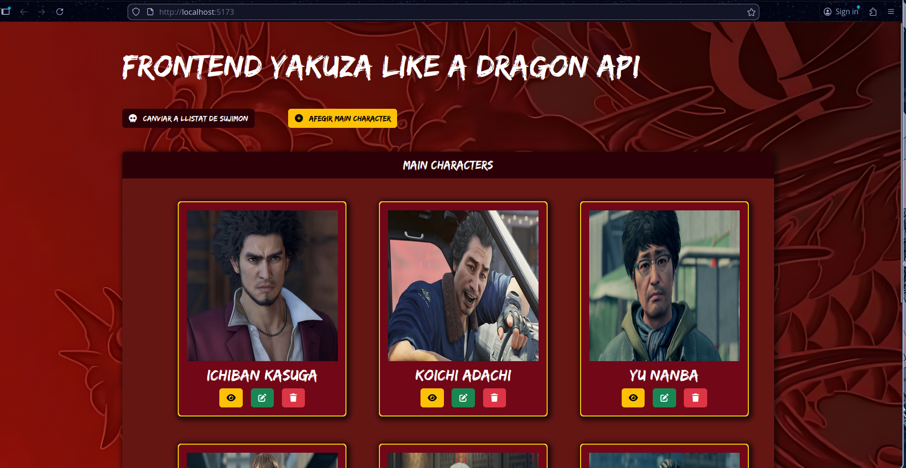

Si accedim a [`localhost:3001`](http://localhost:3001) veurem un healthcheck detallat sobre l'API i a [`localhost:3001/api-docs`](http://localhost:3001/api-docs) per consultar la documentació de l'API i provar els endpoints:

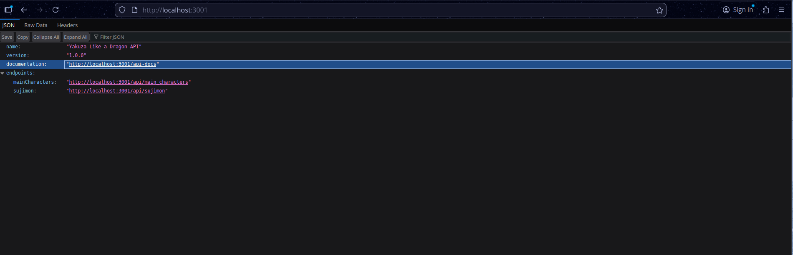

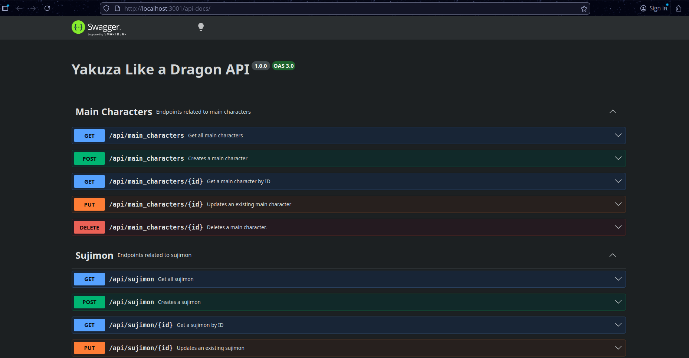

---

<a id="-installacio-docker"></a>

## 🐳 Instal·lació (Docker)

### 1. Clonar el repositori

```bash
git clone https://github.com/aaroncano2006/yakuza_like_a_dragon_api.git
```

O amb clau SSH:

```bash
git clone git@github.com:aaroncano2006/yakuza_like_a_dragon_api.git
```

### 2. Configurar variables d'entorn (Backend)

Situa't a `yakuza_like_a_dragon_api`:

```bash
cd yakuza_like_a_dragon_api
```

Còpia el fitxer `.env.example` amb el nom `.env`

```env
cp .env.example .env
```

Omple les variables d'entorn per a execució en Docker:

```env
# FOR DOCKER
MONGODB_URI=mongodb://mongo:27017/yakuza_like_a_dragon_api
CORS_ORIGIN=http://localhost:3001
HOST=http://localhost
PORT=3001
```

És important que el host de MongoDB sigui l'indicat anteriorment, ja que d'aquest forma l'API podrà reconéixer el contenidor dins de la xarxa Docker i fer les peticions. Indicant `localhost` i el port al que apunta el MongoDB local ens donarà error.

### 3. Crear `.env` a l'arrel del projecte

Ens situem a l'arrel del projecte:

```bash
cd ..
```

Copiem el fitxer `.env.example` amb el nom `.env` i omplim la variable d'entorn amb el port de la nostra màquina que utilitzarà

```bash
cp .env.example
```

```env
MONGO_PORT=27017 # (Pot ser un altre port disponible, o deixar-ho buit per agafar el 27017 per defecte)
```

### 4. Executar Docker Compose

```bash
docker compose up --build -d
```

Aixecarà 3 contenidors:

- MongoDB 8.0
- API (sobre Node 22 Alpine)
- Frontend (sobre Nginx)

Accedim al frontend des de [`localhost:8080`](http://localhost:8080):

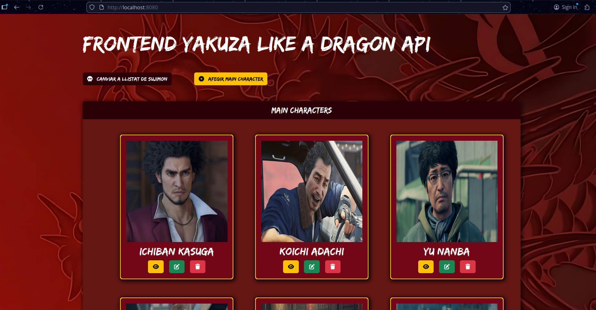

**Nota:** A l'executar l'aplicació amb Docker s'executen automàticament un seeders amb dades de prova, no fa falta executar-los manualment a diferència de la instal·lació en local.

Accedim a [`localhost:3001`](http://localhost:3001) per veure el healthcheck i a [`localhost:3001/api-docs`](http://localhost:3001/api-docs) per consultar la documentació de l'API i provar els endpoints:

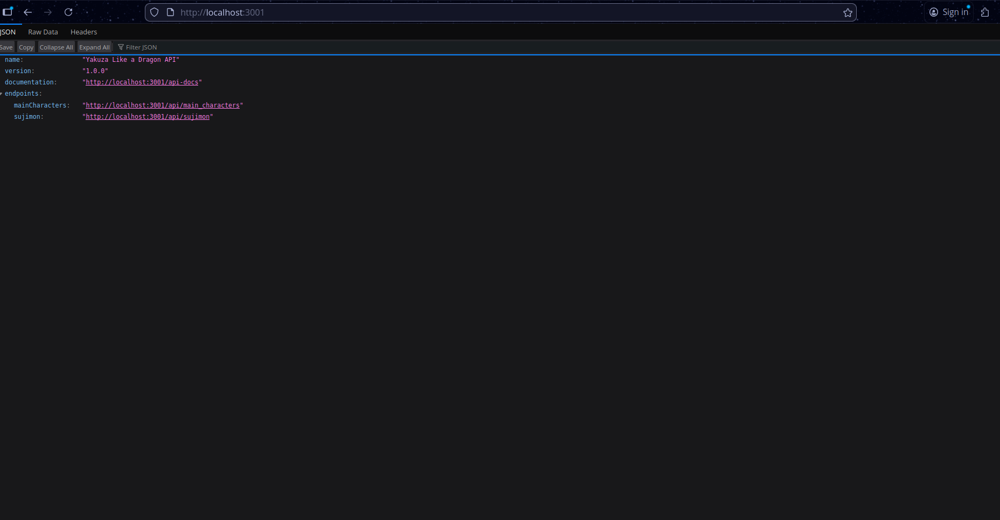


---

<a id="-funcionalitats"></a>

## ⏩ Funcionalitats

<a id="-afegir-element"></a>

### ➕ Afegir element

Clicant el botó **Afegir Main Character** o **Afegir Sujimon** obrirem una finestra Modal amb el formulari de creació:

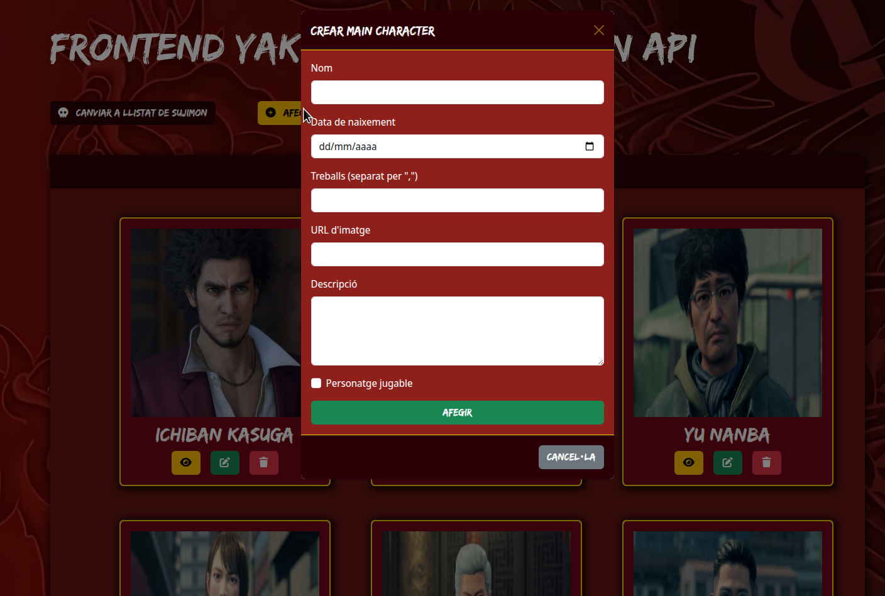

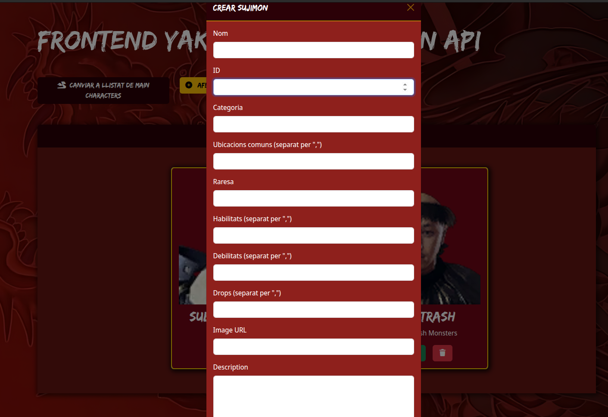

Els camps obligatoris i validacions per Main Character són els següent:

- **Nom**: Obligatori. Mínim un caràcter, no pot estar buit.

- **Data de naixement**: Opcional. Format de data vàlid (per exemple: dd/mm/YYYY).

- **Treballs**: Opcional. Text separat per "," (exemple: _Heroe,Freelancer_), internament es fa la conversió a array.

- **Imatge**: Opcional. URL vàlida.

- **Descripció**: Opcional.

- **És jugable**: Marca la checkbox en funció de si el personatge és jugable o no, en cas de no marcar-la l'aplicació desarà el personatge com a no jugable.

Si es crea correctament veurem una alerta indicant-ho.


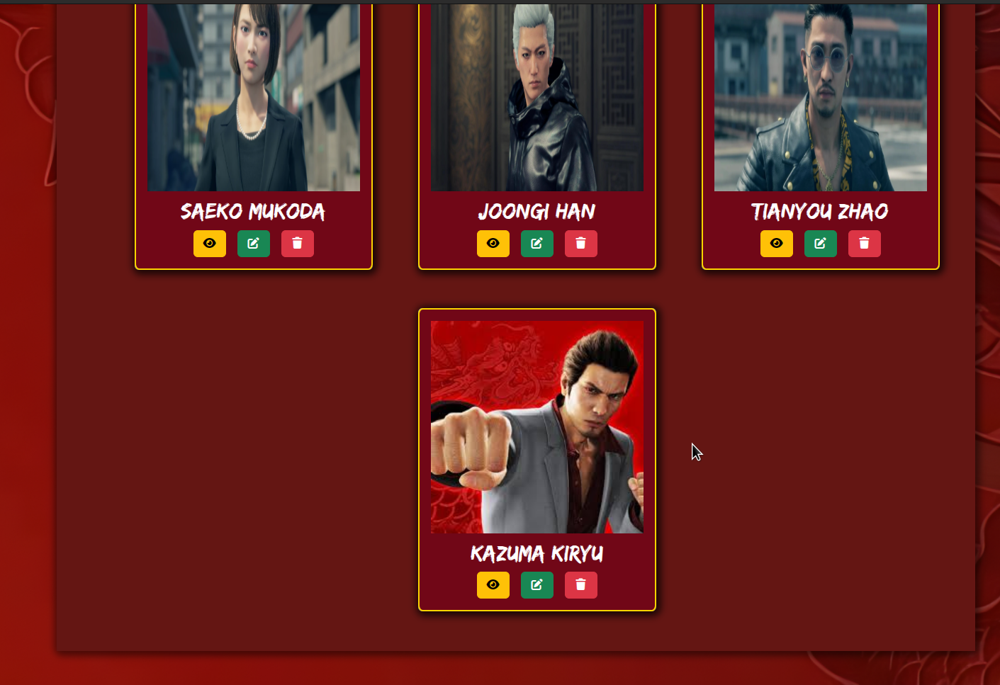

Els camps obligatoris i validacions per Sujimon són els següents:

- **Nom**: Obligatori. Mínim un caràcter, no pot estar buit.

- **ID**: Obligatori. ID numèrica que correspon amb la seva entrada a la Sujidex del videojoc Yakuza Like a Dragon.

- **Categoria**: Obligatori. Mínim un caràcter.

- **Ubicacions comuns**: Obligatori. Text separat per "," (per exemple: _Isezaki Ijincho,Kamurocho_), internament es fa la conversió a array.

- **Raresa**: Obligatori. Número sencer entre 1 i 5.

- **Habilitats**: Obligatori. Text separat per "," (per exemple: _Bayoneta Fantasma,Golpear_), internament es fa la conversió a array.

- **Debilitats**: Obligatori. Text separat per "," (per exemple: _Fuego,Cortante_), internament es fa la conversió a array.

- **Drops**: Obligatori. Text separat per "," (per exemple: _Piedra misteriosa,Rubí en bruto_), internament es fa la conversió a array.

- **Imatge**: Opcional. URL vàlida.

- **Descripció**: Opcional.

Si es crea correctament veurem una alerta indicant-ho.

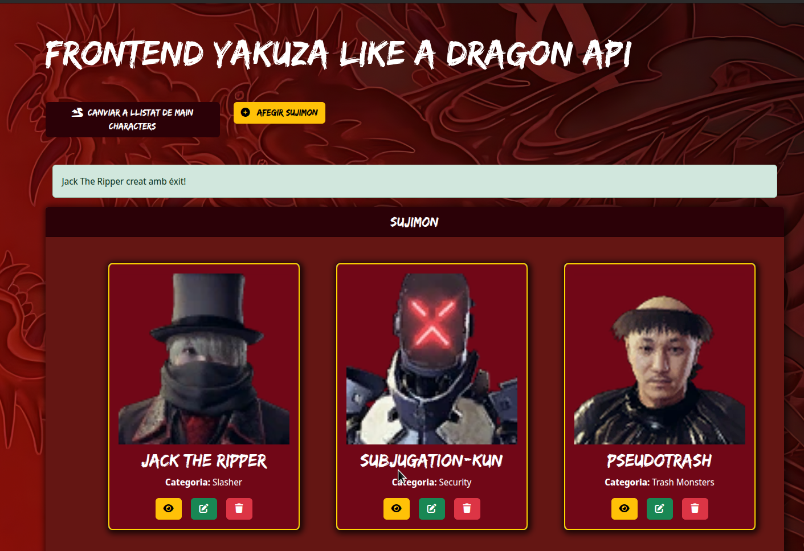

<a id="-mostrar-detall-de-lelement"></a>

### 👁️ Mostrar detall de l'element

Clicant al **botó de detall (icona de l'ull)** podem visualitzar en una finestra Modal tota la informació de l'element seleccionat amb tots els seus camps.

**Detall de Main Character:**

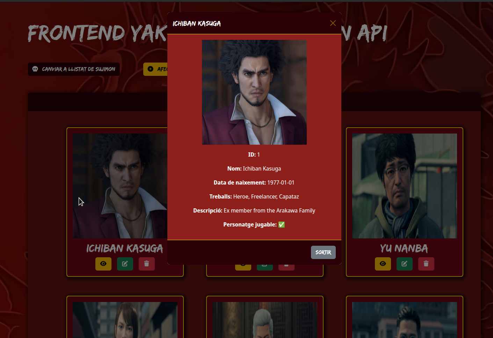

**Detall de Sujimon:**

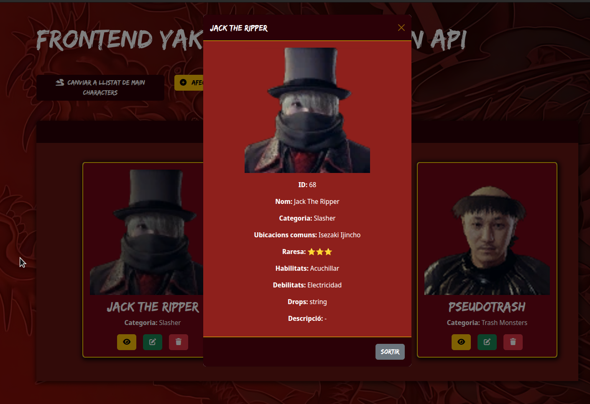

<a id="-editar-element"></a>

### ✏️ Editar element

Clicant al **botó d'editar (icona llapis)** podem editar l'element seleccionat seguint els **camps obligatoris i validacions** especificats a l'apartat [➕ Afegir Element](#-afegir-element).

**Editar Main Character:**

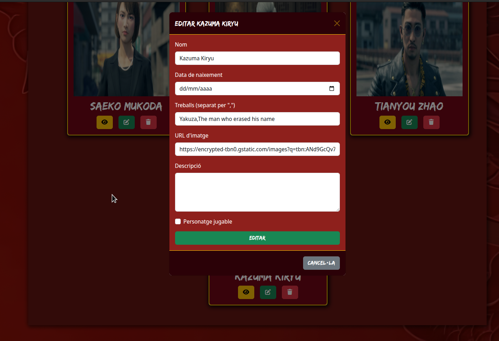

Si passa la validació, sortirà un missatge indicant que s'ha editat correctament:

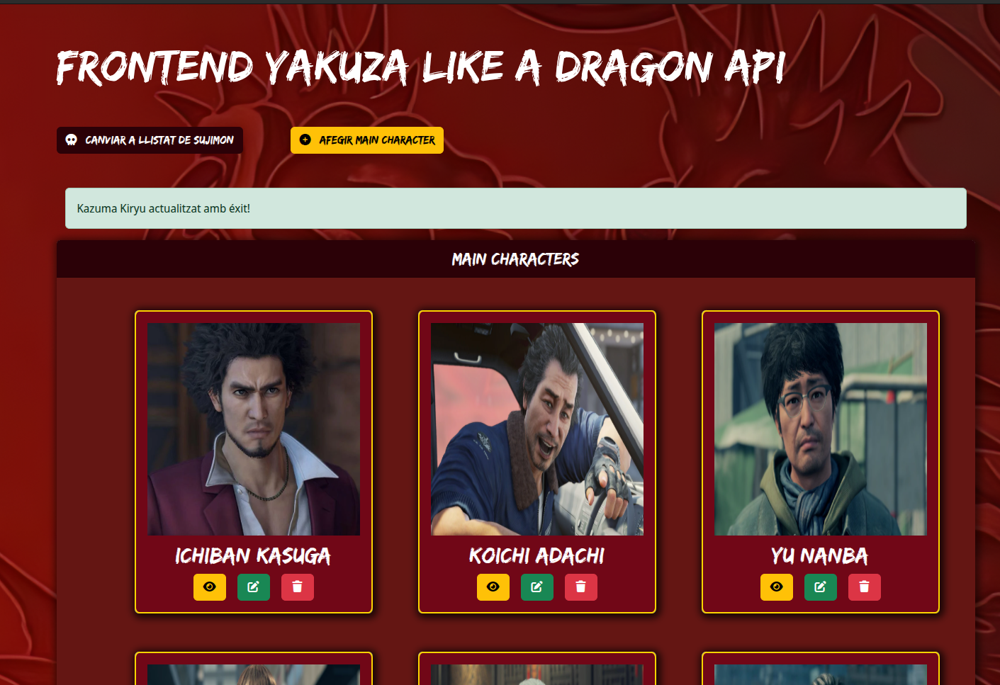

**Editar Sujimon:**

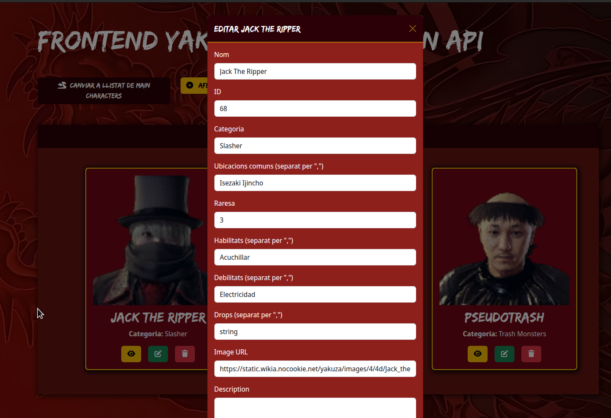

D'igual forma, si tot surt bé veurem un missatge indicant-ho:

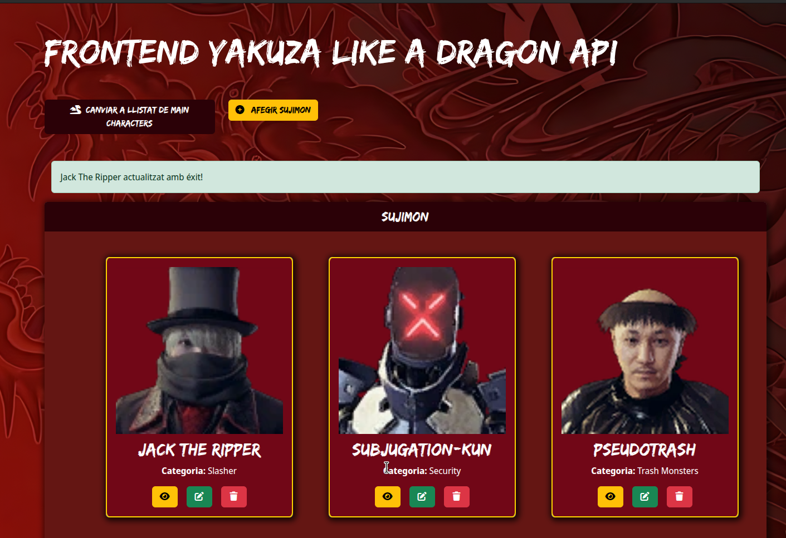

<a id="-eliminar-element"></a>

### 🚮 Eliminar element

Clicant al **botó d'eliminar (icona paperera)** podem eliminar un element.

Abans d'eliminar-ho ens demanarà confirmar l'operació:

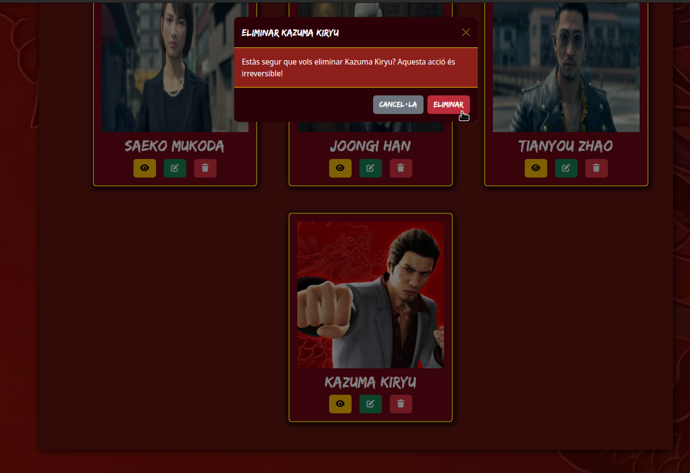

Si tot surt bé, el personatge s'haurà eliminat del llistat i serem notificats:

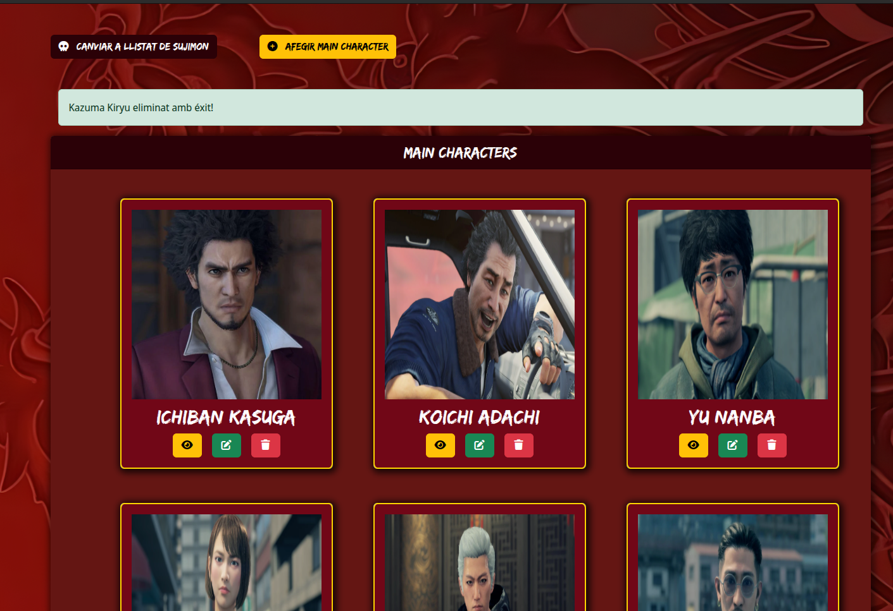

<a id="-canviar-llistat"></a>

### 🔁 Canviar de llistat

Clicant el botó de "Canviar de llistat" podem alternar entre els Main Characters i els Sujimon


---

<a id="-endpoints-de-lapi"></a>

## 🔌 Endpoints de l'API

### 📌 Informació General

Tots els endpoints estan prefixats amb `/api` i retornen respostes en format JSON.

- **URL Base (Local i Docker):** [`http://localhost:3001`](http://localhost:3001)
- **Documentació Swagger:** [`/api-docs`](http://localhost:3001/api-docs)

---

### Main Characters
- GET /api/main_characters → Obtener todos
- GET /api/main_characters/{id} → Obtener uno
- POST /api/main_characters → Crear
- PUT /api/main_characters/{id} → Actualizar
- DELETE /api/main_characters/{id} → Eliminar

### Sujimon
- GET /api/sujimon
- GET /api/sujimon/{id}
- POST /api/sujimon
- PUT /api/sujimon/{id}
- DELETE /api/sujimon/{id}

---

### Eines

- [Postman](https://www.postman.com/)
- [`curl`](https://curl.se/)
- [Documentació Swagger](http://localhost:3001/api-docs) (integrada al repositori i especifica de l'API, **recomanda**)

---

<a id="-autor"></a>

## 👤 Autor

**Aarón Cano Fernández**  
💻 2n de DAW  
📍 Institut Carles Vallbona (Granollers, Barcelona, Espanya)
